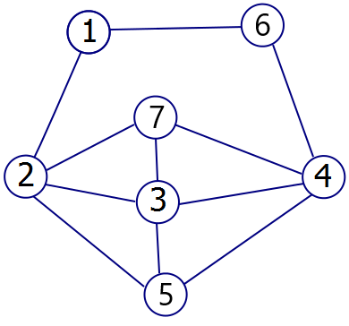

# SAT-and-SMT-Problems
A Java program that solves the graph coloring and Sudoku problems by using SAT and SMT encoding.

## Files
- Main.java: The main class that executes the solvers for GraphColoring.java and Sudoku.java
- GraphColoring.java: The class containing the program that solves the graph coloring problem.
- Sudoku.java: The class containing the program that solves the Sudoku problem.
- input_graph.txt: The input file used in GraphColoring.java, which represents a graph (number of vertices, number of colors, edges).
- output_graph.txt: The file that GraphColoring.java outputs, which contains either "No Solution" or a satisfying assignment of colors to vertices.
- input_sudoku.txt: The input file used in Sudoku.java, which represents the initial Sudoku grid.
- output_sudoku.txt: The file that Sudoku.java outputs, which contains either "No Solution" or the completed Sudoku grid.

## Setup (on Windows) & Compiling/Running
1. Install the Z3 Java binding (https://github.com/Z3Prover/z3)
2. Open IntelliJ IDEA
3. Open the terminal of IntelliJ IDEA and navigate to the program’s directory: ...\solvers
4. Then type the following commands in the terminal of IntelliJ IDEA:
- javac -cp lib/com.microsoft.z3.jar -d bin -sourcepath src src/cmpt/Main.java
- java -cp "bin;lib/com.microsoft.z3.jar" cmpt.Main

## Demo
To use the solver for GraphColoring.java, open input_graph.txt and type in the number of vertices and number of colors on the first line. Then on the next line, type the edges (adjacent vertex labels) of the graph on one line per edge. See below:

input_graph.txt:
```
7 3
1 2
1 6
2 3
2 5
2 7
3 4
3 5
3 7
4 5
4 6
4 7
```


output_graph.txt:
```
1 2
2 1
3 2
4 1
5 3
6 3
7 3
```
To use the solver for Sudoku.java, open input_sudoku.txt and type in the initial digits for the grid, where 0 means the cell is empty. See below:

input_sudoku.txt:
```
5 3 0 0 7 0 0 0 0
6 0 0 1 9 5 0 0 0
0 9 8 0 0 0 0 6 0
8 0 0 0 6 0 0 0 3
4 0 0 8 0 3 0 0 1
7 0 0 0 2 0 0 0 6
0 6 0 0 0 0 2 8 0
0 0 0 4 1 9 0 0 5
0 0 0 0 8 0 0 7 9
```


output_sudoku.txt:
```
5 3 4 6 7 8 9 1 2 
6 7 2 1 9 5 3 4 8 
1 9 8 3 4 2 5 6 7 
8 5 9 7 6 1 4 2 3 
4 2 6 8 5 3 7 9 1 
7 1 3 9 2 4 8 5 6 
9 6 1 5 3 7 2 8 4 
2 8 7 4 1 9 6 3 5 
3 4 5 2 8 6 1 7 9
```

